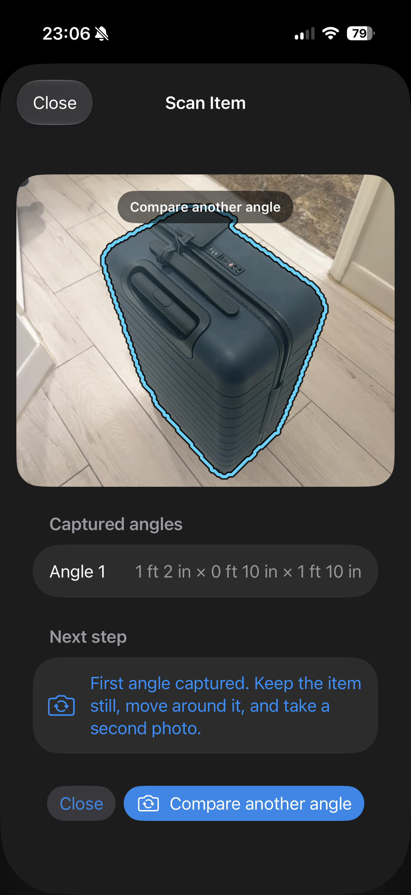
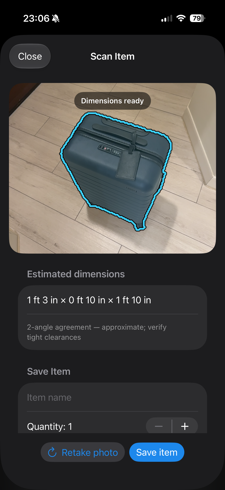

# PackMeasure

PackMeasure is a native iPhone LiDAR app for estimating the rectangular
packing size of boxes, furniture, and other moving items. Each saved scan adds
to a cargo-floor estimate, cubic volume, and a conservative van or moving-truck
recommendation.

## Project status

PackMeasure is an early open-source alpha. The end-to-end scan, local inventory,
packing totals, and vehicle-planning flows work on a LiDAR-equipped iPhone, but
real-device dimensional calibration is still in progress. A recent known-box
check measured a stated 24 × 20 × 20-inch box as 24 × 24 × 20 inches. Do not use
the current estimates as the sole basis for tight clearances or safety-critical
loading decisions.

## App preview

These real-device scans show PackMeasure tracing the isolated item after the
first viewpoint and presenting an accepted estimate. The screenshots are from
an earlier two-angle development build; the current scanner requires a third,
height-diverse viewpoint before it will enable saving.

| Trace the item | Review the estimate |
| --- | --- |
|  |  |

## Use it

1. Put one item in view with visible separation from the background.
2. Stand at a three-quarter angle so the front, side, and top are visible.
3. Keep the whole item inside the guide and tap **Take photo**.
4. Keep the item still, move around it, and capture the requested second angle.
   PackMeasure verifies camera movement from the same AR session instead of
   counting another photo from the same spot.
5. Capture the required third angle from another side with the phone at least
   about 8 inches (20 cm) higher or lower than an earlier viewpoint. A third
   photo without enough height change is rejected without discarding the first
   two captures.
6. Review the approximate three-view result and its contributing angle rows.
   PackMeasure retains the larger supported value on each agreeing axis, while
   a materially larger discordant result blocks saving instead of being
   discarded.
7. Set quantity, stacking, and whether the item may safely turn on its side,
   then save it.

PackMeasure compares raw meter values, not the rounded inches shown in the UI.
Agreement improves repeatability but does not prove ground-truth accuracy. The
scanner also requires broad LiDAR support across the isolated silhouette and
at both image-axis endpoints, but tight clearances still need an independent
check. Clear, matte boxes with visible edges produce the best first-pass
measurements. Glass, mirrors, shiny metal, thin objects, heavy occlusion, and
items touching a similarly deep background can be harder for LiDAR to isolate.

## Understand the plan

- **Cargo floor** is the stack-adjusted footprint plus a 10% packing allowance.
- **Cargo volume** is the measured rectangular volume plus the same allowance.
- **Load mix** applies a realistic usable-volume fraction for boxes, mixed
  household goods, or bulky furniture.
- A vehicle is recommended only when every item clears its estimated interior
  and rear door with a two-inch fit buffer.

Rental fleets vary. Verify the assigned vehicle's interior and rear-door
measurements before booking or loading.

## Install on an iPhone

1. Open `PackMeasure.xcodeproj` in Xcode 27.
2. Select the **PackMeasure** target, then **Signing & Capabilities**.
3. Leave **Automatically manage signing** enabled, choose your Personal Team,
   and replace the example bundle identifiers if Xcode reports a conflict.
4. Connect and unlock the iPhone, select it as the run destination, and press
   **Run**.
5. Approve trust or Developer Mode if iOS requests it, then allow camera access
   on first launch.

The app requires an iPhone or iPad with LiDAR scene-depth support. Inventory is
stored locally in the app's Application Support directory; the app has no
network service.

## Verify the project

```sh
xcodegen generate
xcodebuild test \
  -project PackMeasure.xcodeproj \
  -scheme PackMeasure \
  -destination 'platform=iOS Simulator,name=iPhone 17 Pro'
```

Simulator tests validate segmentation, geometry, persistence, and packing
math, but the simulator cannot validate LiDAR accuracy. Use
`Docs/DeviceCalibration.md` for the real-device check.

## Contributing

Bug reports, calibration fixtures, device results, and focused pull requests
are welcome. Please include tests for geometry, scanner-state, or packing-logic
changes and clearly distinguish simulator evidence from physical LiDAR results.

## License

PackMeasure is available under the [MIT License](LICENSE).
